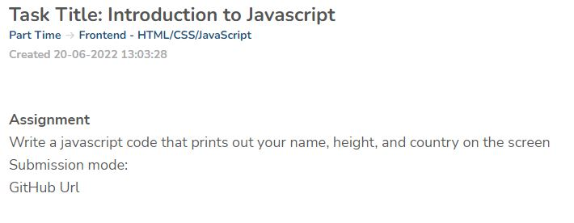
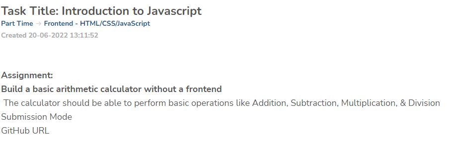

# ZURI ACADEMY

### My name is Ajor Moses, I'm an intern at Zuri Academy, this is my repository containing all the task assignment in the academy.

### 1. Write a javascript code that prints out your name, height, and country on the screen

(a) Solution link of task assessment: [ https://replit.com/@ajormoses/StandardWateryCompiler ]

(b) Live link of task assessment: [ https://StandardWateryCompiler.ajormoses.repl.co ]

### 2. Build a basic arithmetic calculator without a frontend (The calculator should be able to perform basic operations like Addition, Subtraction, Multiplication, & Division)

(a) Solution link of task assessment: [ https://replit.com/@ajormoses/zuri-calculator ]

### Author

- [Githubpage](#Githubpage): [ https://github.com/ajormoses ]
- [Linkedin](#Linkedin) : [ https://www.linkedin.com/in/moses-ajor-0b99291a7/ ]
- [Twitter](#Twitter) : [ https://twitter.com/ajor_moses ]
